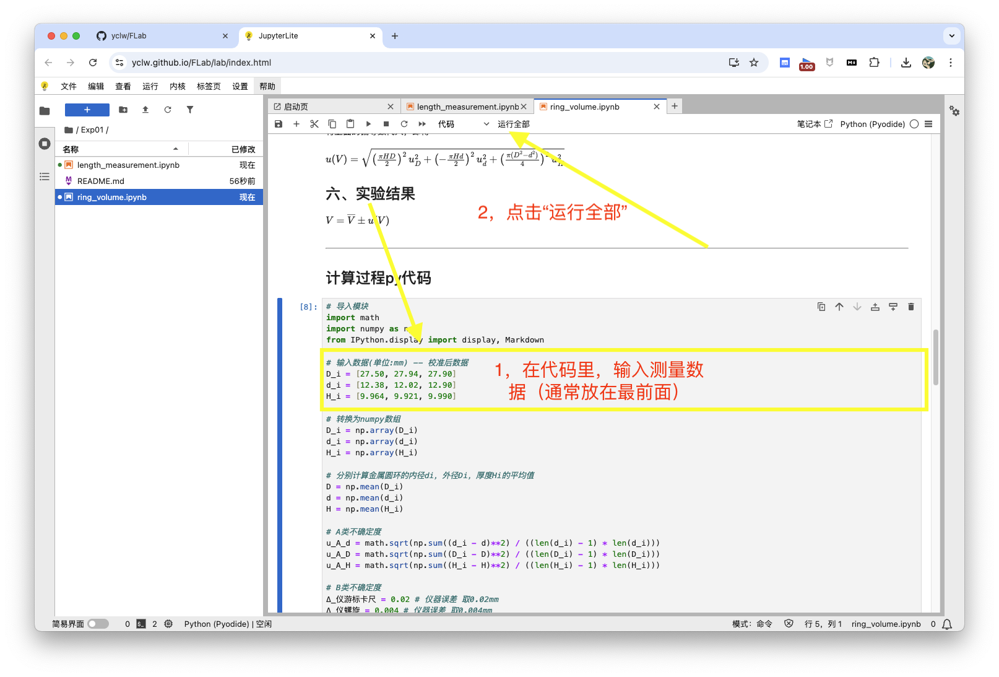
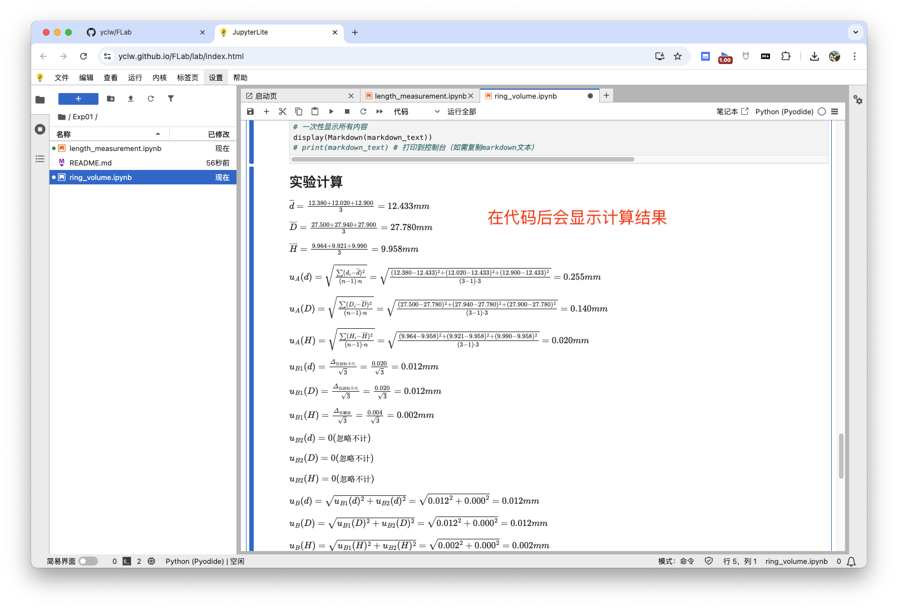

# Exp01 金属圆环体积测量实验

本目录包含：
- 刻度尺长度测量实验 `ring_length.ipynb`，用于测量刻度尺长度。
- 实验报告及计算代码 `ring_volume.ipynb`，用于金属圆环体积的测量与不确定度分析。

## 推荐使用方式

直接在浏览器中访问下方链接即可在线查看和运行实验报告与计算代码：

[金属圆环体积的测量与不确定度分析](https://yclw.github.io/FLab/lab/index.html?path=Exp01%2Fring_volume.ipynb)

[刻度尺长度测量实验](https://yclw.github.io/FLab/lab/index.html?path=Exp01%2Flength_measurement.ipynb)

---

## 操作演示

**1. 输入数据并点击运行：**

**2. 显示计算结果：**

